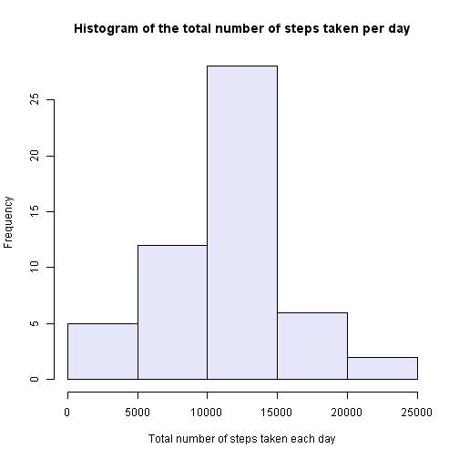
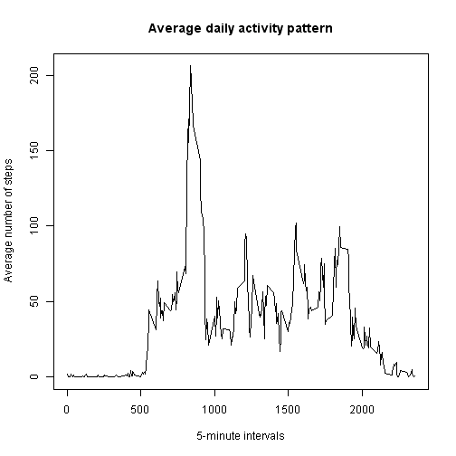
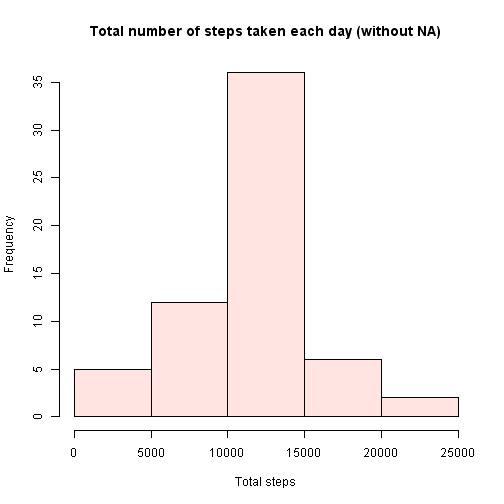
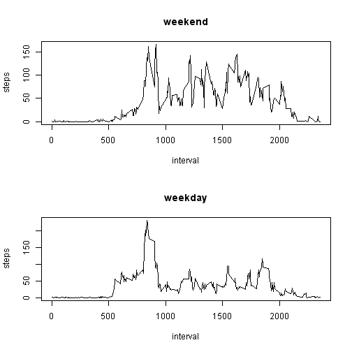

Peer Assesment Project 1
========================================================
### Reproducible Research, Coursera Data Science, July 2014


## Introduction


This assignment makes use of data from a personal activity monitoring device. This device collects data at 5 minute intervals through out the day. The data consists of two months of data from an anonymous individual collected during the months of October and November, 2012 and include the number of steps taken in 5 minute intervals each day.


## Data


The data for this assignment can be downloaded from the course web site: [Activity monitoring data](https://d396qusza40orc.clouactront.net/repdata%2Fdata%2Factivity.zip) [52K]

The variables included in this dataset are:

  * __steps__: Number of steps taking in a 5-minute interval (missing values are coded as `NA`)
  * **date**: The date on which the measurement was taken in YYYY-MM-DD format
  * **interval**: Identifier for the 5-minute interval in which measurement was taken
 
The dataset is stored in a comma-separated-value (CSV) file and contains a total of 17,568 observations.


### 1. Loading and preprocessing the data


The report assumes that `activity.zip` is present in the working directory together with this `PA1_template.Rmd` file. 


```r
# let's first unzip and read the data into a dataframe
act <- read.csv(unzip("activity.zip"))

# now set the column with dates to the appropirate ate type
act$date <- as.Date(act$date , format = "%Y-%m-%d")

# agregate new dataframe per total steps / day and name the columns 
act.day <- aggregate(act$steps, by=list(act$date), sum)
names(act.day)[2] <- "steps"
names(act.day)[1] <- "date"

# agregate new dataframe per total steps / interval and name the columns 
act.interval <- aggregate(act$steps, by=list(act$interval), sum)
names(act.interval)[2] <- "steps"
names(act.interval)[1] <- "interval"

# agregate new dataframe with mean number of steps per interval and name the columns
act.m.interval <- aggregate(act$steps, by=list(act$interval), mean, na.rm=TRUE, na.action=NULL)
names(act.m.interval)[1] <- "interval"
names(act.m.interval)[2] <- "mean.steps"
```

### 2. What is mean total number of steps taken per day?

Ok, here goes the histogram:


```r
hist(act.day$steps, col = "lavender", main = "Histogram of the total number of steps taken per day",
     xlab = "Total number of steps taken each day")
```

 

And here we calculate the **mean** and **median** total number of steps taken per day:


__Mean__:

```r
mean(act.day$steps, na.rm = TRUE)
```

```
## [1] 10766
```

__Median__:

```r
median(act.day$steps, na.rm = TRUE )
```

```
## [1] 10765
```


### 3. What is the average daily activity pattern?


We want to make a time series plot of the 5-minute interval on x-axis, and the average number of steps taken across all days on y-axis. 


```r
plot(act.m.interval$interval, act.m.interval$mean.steps, type = "n", main = "Average daily activity pattern", xlab = "5-minute intervals", ylab = "Average number of steps") 
lines(act.m.interval$interval, act.m.interval$mean.steps, type = "l") 
```

 


Now let's calculate which 5-minute interval, on average across all the days in the dataset, contains the maximum number of steps?


```r
act.m.interval[which.max(act.m.interval$mean.steps), 1]
```

```
## [1] 835
```


### 4. Inputing missing values

The presence of missing days may introduce bias into some calculations or summaries of the data. Let's explore and see if that's the case.

1. _Total number of missing values in the dataset:_


```r
sum(is.na(act$steps))
```

```
## [1] 2304
```

2. _Let's correct this by replacing the missing values with the mean of the interval from the `act.m.interval` dataframe._


```r
# merge
act.miss <- merge(act, act.m.interval, by = "interval", sort= FALSE)
#replace
act.miss$steps[is.na(act.miss$steps)] <- act.miss$mean.steps[is.na(act.miss$steps)]
```


3. _Now we can create a new dataset without the missing data._


```r
act.nona <- act.miss[, c(2,3,1)]
```

4. _Finally, we can compare the data from new and old dataset._ 

First we create the new dataframe with total steps per day:

```r
act.day.new <- aggregate(act.nona$steps, by=list(act.nona$date), sum)
names(act.day.new)[1] <-"day"
names(act.day.new)[2] <-"steps"
```

Let's explore the histogram:


```r
hist(act.day.new$steps, col = "mistyrose",
     main = "Total number of steps taken each day (without NA)",
     xlab = "Total steps")
```

 

The shape of the distribution did not seem to change, but total steps frequency increased equally across days. 

Let's check the __mean__ and __median__ values:

*Mean*

```r
mean(act.day.new$steps)
```

```
## [1] 10766
```

*Median*

```r
median(act.day.new$steps)
```

```
## [1] 10766
```


__Mean__ value is the same as before replacing the missing values, while the __median__ is a negligibly lower.


### 5. Are there differences in activity patterns between weekdays and weekends?


1. _Start with creating a new factor variable in the dataset with two levels - "weekday" and "weekend"._


```r
# Let's make sure that the locale is set to English
Sys.setlocale("LC_TIME", "English")
```

```
## [1] "English_United States.1252"
```

```r
# Weekday or Weekend?
wday <- function(date) {
    if (weekdays(as.Date(date)) %in% c("Saturday", "Sunday")) {
        "weekend"
    } else {
        "weekday"
    }
}

# Set the 'wday' factor variable as the new column 
act.nona$wday <- as.factor(sapply(act.nona$date, wday))
```

2. _Again, we want to make a time series plot (panel this time) of the 5-minute interval on x-axis, and the average number of steps taken across all days on y-axis._


```r
par(mfrow=c(2,1))
for (type in c("weekend", "weekday")) {
    steps.type <- aggregate(steps ~ interval, data = act.nona, subset = act.nona$wday==type, FUN = mean)
    plot(steps.type, type = "l", main = type)
}
```

 
